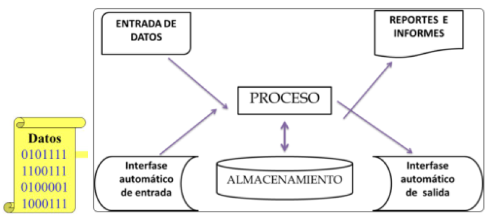
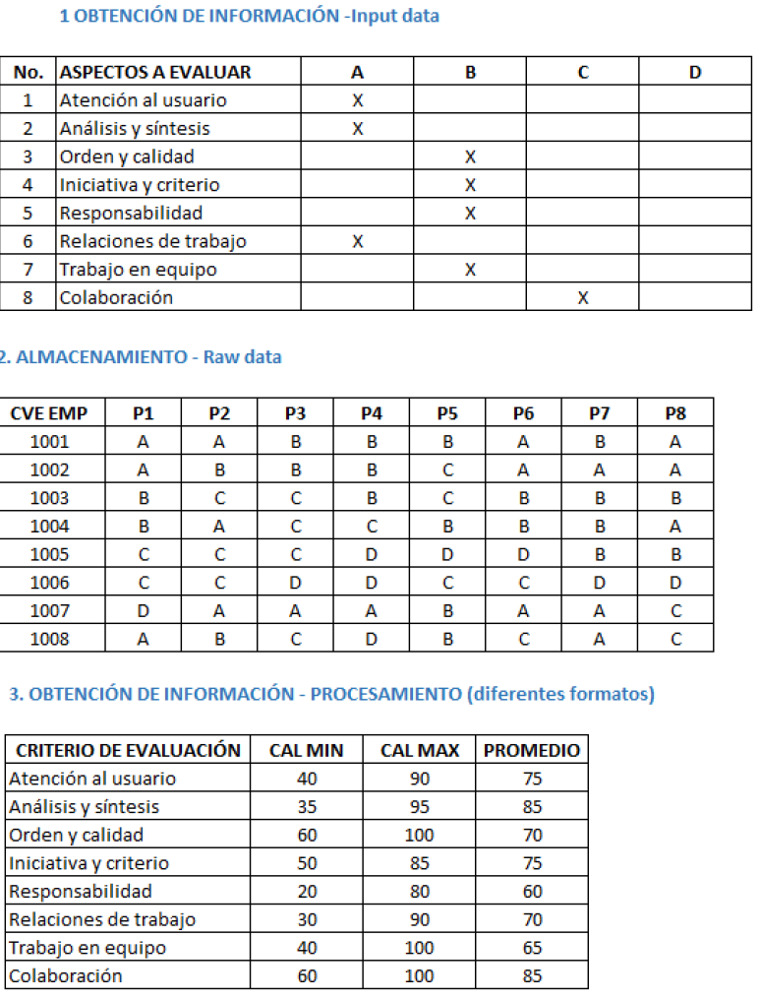
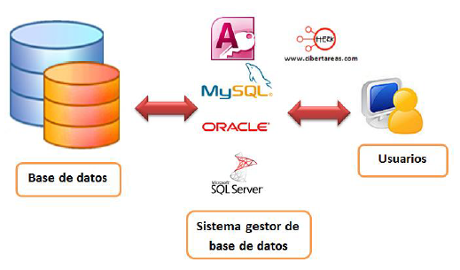
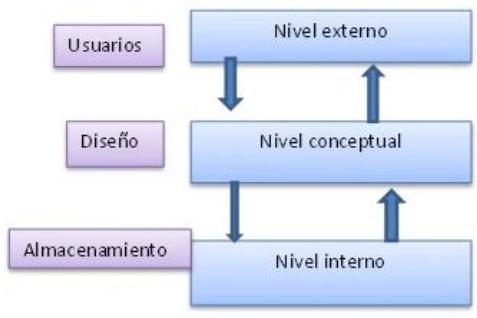
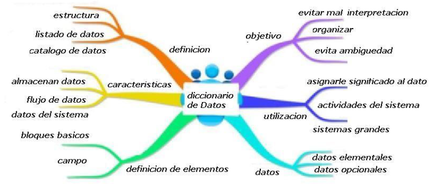
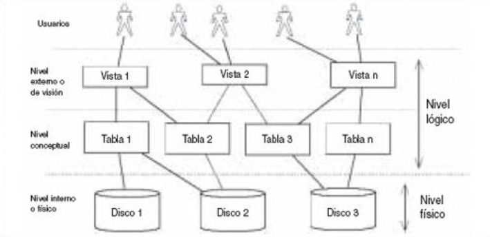
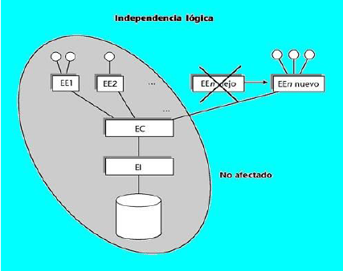
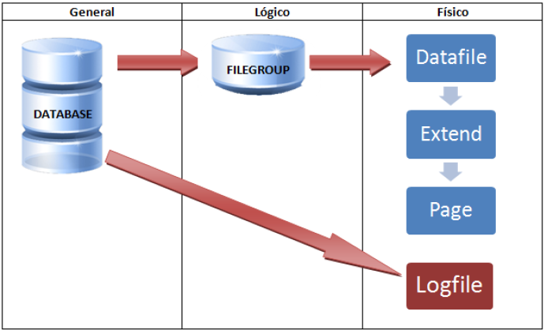
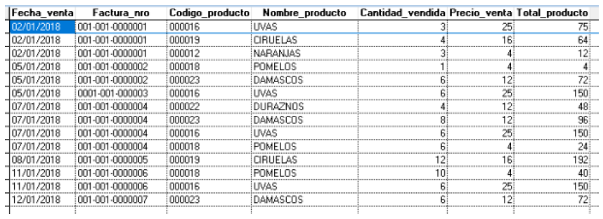
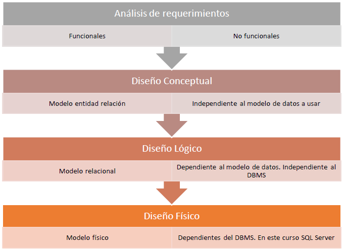

# Tema 1 - Introducción a las Bases de Datos

## Descripción

En este tema se presentan los conceptos fundamentales que sustentan las bases de datos, la administración de la información y las metodologías utilizadas para diseñarlas e implementarlas.

Se estudian los componentes de un sistema de bases de datos, sus arquitecturas, los distintos modelos de datos y el proceso general para desarrollar una base de datos.

---

## Índice

- [Datos e información](#datos-e-información)
- [Bases de datos y DBMS](#bases-de-datos-y-dbms)
- [Arquitectura de bases de datos](#arquitectura-de-bases-de-datos)
- [Tipos de bases de datos](#tipos-de-bases-de-datos)
- [Sistema de bases de datos](#sistema-de-bases-de-datos)
- [Modelos de datos](#modelos-de-datos)
- [Metodologías de diseño de bases de datos](#metodologías-de-diseño-de-bases-de-datos)

---

# Datos e información

## ¿Por qué son importantes?

Los datos son uno de los recursos más importantes dentro de cualquier organización, ya que permiten generar información útil para la toma de decisiones.

Las bases de datos facilitan:

- El almacenamiento masivo de información.
- La disponibilidad de los datos.
- La seguridad de la información.
- El acceso rápido a los datos.
- La toma oportuna de decisiones.

  

---

## Dato

Un dato es un conjunto de símbolos almacenados en algún medio.

Puede ser:

- Numérico.
- Alfabético.
- Alfanumérico.
- Un signo o símbolo.

Un dato por sí solo no posee significado.

---

## Información

La información surge al procesar un conjunto de datos.

El procesamiento puede consistir en:

- Ordenar datos.
- Clasificarlos.
- Realizar cálculos.
- Analizarlos estadísticamente.

### Características

- **Significado:** posee semántica.
- **Importancia:** depende del receptor.
- **Vigencia:** está limitada por tiempo y contexto.
- **Valor:** es un activo intangible.

### Ejemplo

Transformación de datos en información mediante un proceso de evaluación.

  

---

## Sistemas de información

Son conjuntos de elementos encargados de:

- Recolectar datos.
- Almacenarlos.
- Procesarlos.
- Recuperarlos.
- Distribuirlos.
- Administrarlos.

Para funcionar correctamente requieren:

- Disponibilidad.
- Manejo de grandes volúmenes de información.
- Uso compartido.
- Concurrencia.
- Permanencia.
- Integridad.
- Respaldos.
- Seguridad.

---

# Bases de datos y DBMS

## Base de datos

Es una colección de datos:

- Relacionados.
- Organizados.
- Estructurados.
- Almacenados persistentemente.

La persistencia permite conservar la información a través del tiempo.

## DBMS (Database Management System)

Es el software encargado de administrar una base de datos.

Actúa como intermediario entre:

- Base de datos.
- Usuarios.
- Aplicaciones.

  

---

## Características de un DBMS

Un DBMS proporciona:

- Abstracción de la información.
- Independencia de los datos.
- Redundancia mínima.
- Consistencia.
- Seguridad.
- Integridad.
- Respaldos y recuperación.
- Control de concurrencia.

### Niveles de abstracción

  

### Lenguajes utilizados

Un DBMS utiliza:

| Lenguaje | Función |
|----------|---------|
| DDL | Definición de estructuras |
| DML | Manipulación de datos |
| DQL | Consulta de datos |
| DCL | Control de acceso |
| Álgebra relacional | Procedimientos |
| Cálculo relacional | Expresiones declarativas |

---

## Diccionario de datos

Es el conjunto de metadatos que describe la estructura de la base de datos.

Contiene información como:

- Tipos de datos.
- Longitudes.
- Relaciones.
- Restricciones.

  

---

## Ventajas y desventajas de un DBMS

### Ventajas

- Manipulación de grandes volúmenes de datos.
- Acceso rápido a la información.
- Control de seguridad.
- Menor tiempo de desarrollo.
- Mayor calidad de los sistemas.
- Interfaces sencillas de consulta.

### Desventajas

- Mayor complejidad.
- Requiere hardware potente.
- Incrementa costos operativos.
- Requiere personal especializado.

---

# Arquitectura de bases de datos

## Arquitectura ANSI-SPARC

Divide la base de datos en tres niveles.

### Nivel interno

Describe el almacenamiento físico.

### Nivel conceptual

Describe la estructura lógica.

### Nivel externo

Presenta vistas específicas para los usuarios.

  

---

## Independencia de los datos

### Independencia física

Permite modificar el almacenamiento físico sin afectar los programas.

### Independencia lógica

Permite modificar la estructura lógica sin afectar a los usuarios.

  

---

## Arquitectura de SQL Server

SQL Server divide la información en:

### Estructura lógica

- Database.
- Filegroups.

### Estructura física

- Datafiles.
- Extends.
- Pages.
- Logfiles.

  

---

# Tipos de bases de datos

## Según el número de usuarios

- Monousuario.
- Grupos de trabajo.
- Empresariales.

## Según la ubicación

- Centralizadas.
- Distribuidas.
- En la nube.

## Según el uso

- OLTP.
- OLAP.

## Según el modelo de datos

- Jerárquicas.
- De red.
- Relacionales.
- Objeto-relacionales.
- Orientadas a objetos.
- Multidimensionales.
- NoSQL.

---

# Sistema de bases de datos

Está formado por:

## Hardware

- Servidores.
- Almacenamiento.
- Redes.

## Software

- Sistemas operativos.
- DBMS.
- Herramientas de monitoreo.

## Usuarios

- Administradores.
- Analistas.
- Diseñadores.
- Programadores.
- Usuarios finales.

## Roles especializados

### Analista de bases de datos

Analiza requerimientos y propone soluciones.

### Diseñador de bases de datos

Construye los modelos de datos.

### Programador de bases de datos

Implementa la solución mediante SQL.

### Administrador de bases de datos (DBA)

Garantiza la disponibilidad y salud de la base de datos.

### Especialista en análisis de datos

Analiza grandes volúmenes de información.

### Arquitecto de bases de datos

Diseña la infraestructura completa.

---

# Modelos de datos

Representan la estructura y comportamiento de los datos.

## Elementos principales

- Entidades.
- Atributos.
- Relaciones.
- Restricciones.

---

## Sistemas de archivos

Fueron los antecedentes de las bases de datos modernas.

Su estructura es:

Caracteres → Campos → Registros → Archivos

  

### Problemas

- Duplicidad.
- Inconsistencias.
- Falta de seguridad.
- Dificultad para obtener información.

---

## Modelo jerárquico

Utiliza una estructura Padre-Hijo.

Características:

- Representa relaciones 1:1 y 1:M.
- Cada hijo solo puede tener un padre.
- Utiliza punteros.

---

## Modelo de red

Permite que una entidad tenga múltiples padres.

Introduce conceptos como:

- Esquemas.
- DDL.
- DML.

---

## Modelo relacional

Representa los datos mediante tablas relacionadas.

Características:

- Fue propuesto por Edgar F. Codd.
- Utiliza teoría de conjuntos.
- Es la base de SQL moderno.

---

## Modelo Entidad-Relación

Permite representar:

- Entidades.
- Relaciones.
- Restricciones.

Es la base del diseño conceptual.

---

## Modelo Orientado a Objetos (OODBMS)

Almacena objetos completos.

Incluye:

- Estado.
- Comportamiento.

---

## Modelo Objeto-Relacional (ORDBMS)

Extiende el modelo relacional incorporando características orientadas a objetos.

Incluye:

- Herencia.
- Tipos personalizados.
- Funciones definidas por el usuario.

---

## Bases de datos multidimensionales

Se utilizan en herramientas OLAP y Business Intelligence.

Características:

- Procesan grandes volúmenes de información.
- Utilizan cubos OLAP.
- Están orientadas al análisis.

---

# Metodologías de diseño de bases de datos

El diseño de una base de datos se divide en cuatro etapas.

  

## 1. Análisis de requerimientos

Se identifican:

- Requerimientos funcionales.
- Requerimientos no funcionales.
- Restricciones del negocio.

## 2. Diseño conceptual

Se construye un modelo Entidad-Relación.

Es independiente del DBMS.

## 3. Diseño lógico

Se traduce el modelo conceptual a un modelo relacional.

## 4. Diseño físico

Se implementa la solución considerando:

- Hardware.
- Rendimiento.
- Concurrencia.
- Disponibilidad.
- Tolerancia a fallos.

---

# Resumen

Las bases de datos permiten almacenar, organizar y administrar grandes volúmenes de información de manera eficiente, segura y accesible.

Un dato por sí solo carece de significado; al ser procesado y contextualizado se transforma en información útil para la toma de decisiones.

Los Sistemas Gestores de Bases de Datos (DBMS) son los encargados de administrar la información y proporcionar herramientas para su almacenamiento, consulta, actualización y protección.

La arquitectura de las bases de datos separa los distintos niveles de representación de la información, permitiendo la independencia entre la forma en que los datos se almacenan físicamente y la manera en que los usuarios los visualizan.

Existen diversos tipos de bases de datos y modelos de datos, cada uno diseñado para resolver necesidades específicas, desde sistemas transaccionales hasta plataformas orientadas al análisis de grandes volúmenes de información.

El desarrollo de una base de datos sigue una metodología estructurada que comienza con el análisis de requerimientos y continúa con el diseño conceptual, lógico y físico, garantizando que la solución implementada satisfaga las necesidades del negocio.