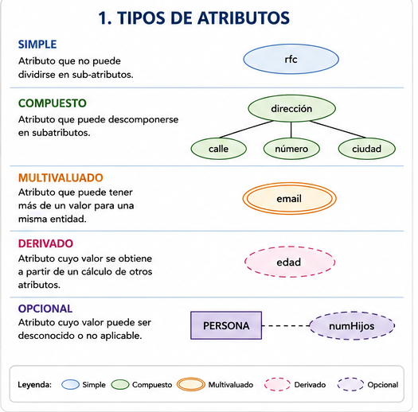
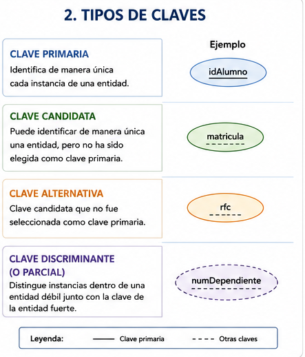
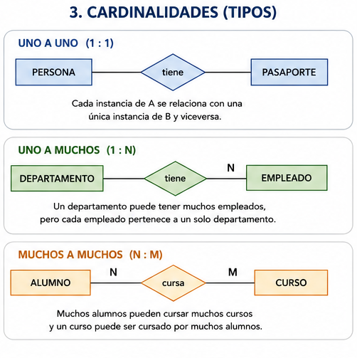
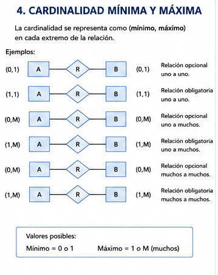
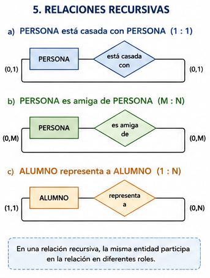
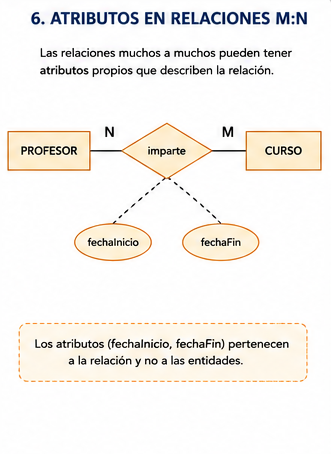
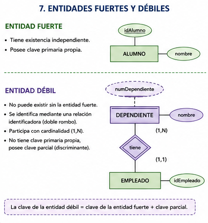

# Diseño Conceptual

El diseño conceptual es la primera etapa formal en el diseño de una base de datos después del análisis de requerimientos.

Su propósito es representar la realidad del negocio mediante un modelo independiente del Sistema Gestor de Bases de Datos (DBMS), permitiendo identificar entidades, atributos, relaciones y restricciones antes de cualquier implementación técnica.

---

# Índice

- [Diseño Conceptual](#diseño-conceptual)
- [Pasos para elaborar el diseño conceptual](#pasos-para-elaborar-el-diseño-conceptual)
- [Modelo Entidad-Relación](#modelo-entidad-relación)
- [Entidad](#entidad)
- [Atributo](#atributo)
- [Tipos de atributos](#tipos-de-atributos)
- [Claves](#claves)
- [Relaciones](#relaciones)
- [Cardinalidades](#cardinalidades)
- [Relaciones recursivas](#relaciones-recursivas)
- [Atributos en relaciones M:M](#atributos-en-relaciones-mm)
- [Entidades fuertes y débiles](#entidades-fuertes-y-débiles)
- [Reglas de negocio](#reglas-de-negocio)
- [Pasos para obtener un MER](#pasos-para-obtener-un-mer)
- [Resumen](#resumen)

---

# Diseño Conceptual

El diseño conceptual permite describir el contenido de información de una base de datos sin considerar detalles de implementación.

Su objetivo principal es representar:

- Entidades.
- Relaciones.
- Restricciones.
- Reglas de negocio.

De esta manera se obtiene una visión clara del problema antes de pasar al diseño lógico.

## Características de un buen modelo conceptual

### Expresividad

Debe poseer suficientes elementos para representar correctamente la realidad.

### Simplicidad

Debe ser fácil de entender para usuarios y analistas.

### Minimalidad

Cada concepto debe tener un único significado.

### Formalidad

Todos los elementos deben tener una interpretación clara y consistente.

---

# Pasos para elaborar el diseño conceptual

## 1. Análisis de requisitos

Consiste en:

- Identificar el entorno.
- Comprender el negocio.
- Determinar qué información se desea representar.

## 2. Generación del modelo conceptual

A partir de los requerimientos se construye un esquema que represente:

- Entidades.
- Atributos.
- Relaciones.
- Restricciones.

---

# Modelo Entidad-Relación

El Modelo Entidad-Relación (MER) fue propuesto por Peter Chen en 1976 y es el modelo conceptual más utilizado para el diseño de bases de datos.

Se basa en la representación de:

- Entidades.
- Atributos.
- Relaciones.

El MER constituye la base para la construcción posterior del modelo lógico.

---

# Entidad

Una entidad es un objeto real o abstracto sobre el cual se desea almacenar información.

## Ejemplos

### Entidades físicas

- Alumno
- Profesor
- Hospital
- Impresora

### Entidades abstractas

- Reservación
- Inscripción
- Viaje

## Características

- Tiene existencia propia.
- Puede distinguirse de otras entidades.
- Posee atributos comunes para todas sus instancias.

---

# Atributo

Un atributo es una característica o propiedad asociada a una entidad o relación.

## Ejemplos

- Nombre
- Dirección
- Fecha de nacimiento
- Teléfono

En el modelo relacional los atributos se convierten posteriormente en columnas.

---

# Tipos de atributos

Existen distintos tipos de atributos dependiendo de sus características.

<p align="center">
  
</p>

## Simple

No puede dividirse en componentes más pequeños.

### Ejemplo

```text
RFC
```

---

## Compuesto

Puede dividirse en varios subatributos.

### Ejemplo

```text
Dirección
├── Calle
├── Número
└── Ciudad
```

---

## Multivaluado

Puede contener múltiples valores para una misma entidad.

### Ejemplo

```text
Correo electrónico
```

---

## Derivado

Se obtiene mediante el cálculo de otros atributos.

### Ejemplo

```text
Edad = Fecha actual - Fecha de nacimiento
```

---

## Opcional

Puede no tener valor para determinadas instancias.

---

# Claves

Las claves permiten identificar instancias dentro de una entidad.

<p align="center">
  
</p>

## Clave primaria

Identifica de forma única cada instancia.

### Ejemplo

```text
Número de expediente
```

---

## Clave débil o discriminante

Se utiliza junto con la clave de una entidad fuerte para identificar entidades débiles.

---

## Clave candidata

Puede identificar de forma única una entidad aunque no haya sido elegida como clave primaria.

---

## Clave alternativa

Es una clave candidata que no fue seleccionada como clave principal.

---

# Relaciones

Una relación representa una asociación entre entidades.

Normalmente se expresa mediante un verbo.

### Ejemplo

```text
PROFESOR imparte MATERIA
```

Las relaciones poseen tres propiedades fundamentales:

- Nombre.
- Grado.
- Cardinalidad.

---

# Cardinalidades

La cardinalidad indica cuántas instancias de una entidad pueden relacionarse con instancias de otra entidad.

<p align="center">
  
</p>

## Uno a Uno (1:1)

Cada instancia se relaciona con una única instancia de la otra entidad.

---

## Uno a Muchos (1:M)

Una instancia puede relacionarse con múltiples instancias de otra entidad.

---

## Muchos a Muchos (M:N)

Varias instancias pueden relacionarse simultáneamente.

---

## Cardinalidad mínima y máxima

<p align="center">
  
</p>

La cardinalidad se representa mediante:

```text
(min,max)
```

### Cardinalidad mínima

Indica el número mínimo de asociaciones.

Valores posibles:

```text
0
1
```

### Cardinalidad máxima

Indica el número máximo de asociaciones.

Valores posibles:

```text
1
M
```

---

# Relaciones recursivas

Una relación recursiva ocurre cuando una entidad se relaciona consigo misma.

<p align="center">
  
</p>

## Ejemplos

### Matrimonio

```text
PERSONA está casada con PERSONA
```

Relación:

```text
1 : 1
```

### Amistad

```text
PERSONA es amiga de PERSONA
```

Relación:

```text
M : N
```

### Representación estudiantil

```text
ALUMNO representa ALUMNO
```

Relación:

```text
1 : M
```

---

# Atributos en relaciones M:M

Las relaciones muchos a muchos pueden poseer atributos propios.

<p align="center">
  
</p>

Estos atributos pertenecen a la relación y no a las entidades participantes.

## Ejemplo

```text
PROFESOR imparte CURSO
```

La relación podría contener:

```text
fechaInicio
fechaFin
```

porque describen la asociación y no a las entidades individuales.

---

# Entidades fuertes y débiles

<p align="center">
  
</p>

## Entidad fuerte

Puede identificarse por sí misma.

Características:

- Posee clave primaria propia.
- Existe independientemente de otras entidades.

---

## Entidad débil

No puede identificarse sin una entidad fuerte.

Características:

- Depende de una entidad fuerte.
- Utiliza una relación identificadora.
- Tiene cardinalidad 1:M.
- No puede existir de manera independiente.

### Tipos

#### Débil por existencia

Posee identificador propio pero depende de la entidad fuerte para existir.

#### Débil por identificación

Necesita la clave de la entidad fuerte para poder identificarse.

---

# Reglas de negocio

Las reglas de negocio ayudan a definir:

- Entidades.
- Relaciones.
- Restricciones.
- Cardinalidades.

## Características

- Son claras.
- Son atómicas.
- No contienen ambigüedades.
- Utilizan lenguaje natural.

---

# Pasos para obtener un MER

1. Identificar entidades.
2. Identificar atributos.
3. Identificar claves primarias.
4. Identificar relaciones.
5. Determinar cardinalidades.
6. Identificar restricciones y reglas de negocio.

---

# Resumen

El diseño conceptual permite representar la realidad del negocio antes de cualquier implementación tecnológica.

Su principal herramienta es el Modelo Entidad-Relación (MER), compuesto por:

- Entidades.
- Atributos.
- Relaciones.
- Cardinalidades.
- Restricciones.

Este modelo constituye la base para las etapas posteriores de diseño lógico y diseño físico de una base de datos.