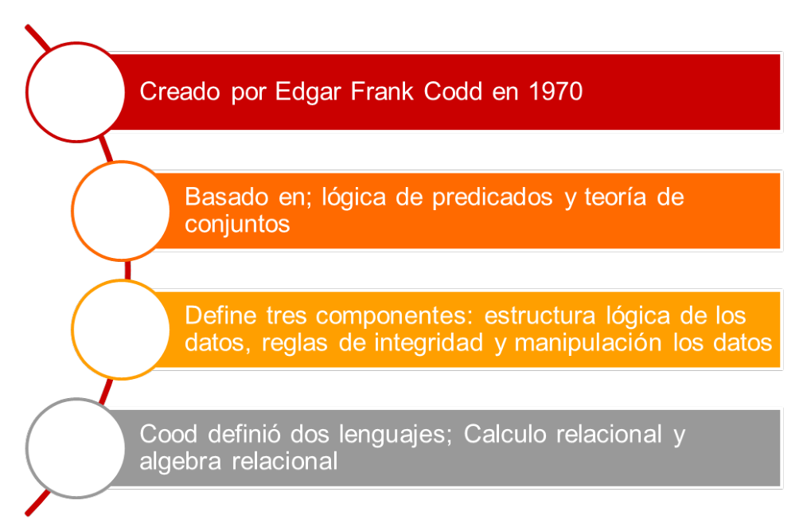
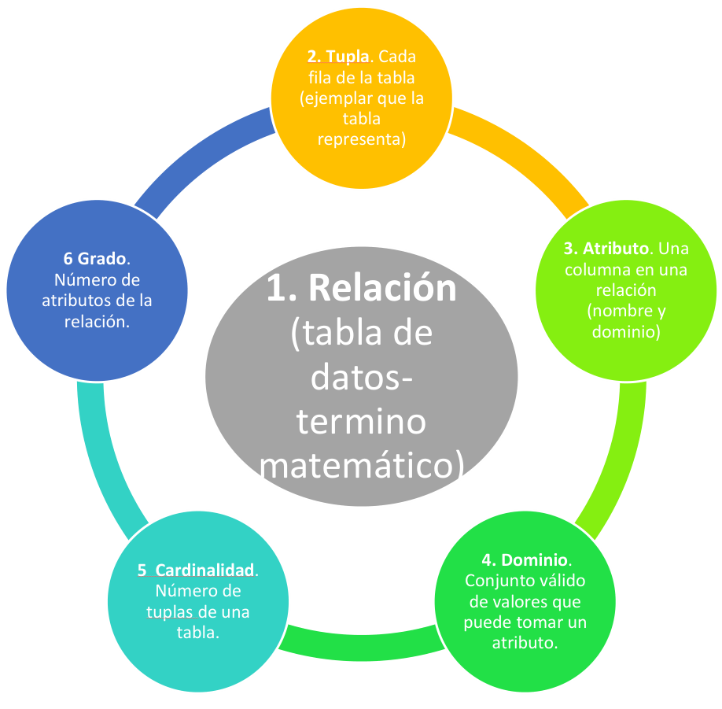
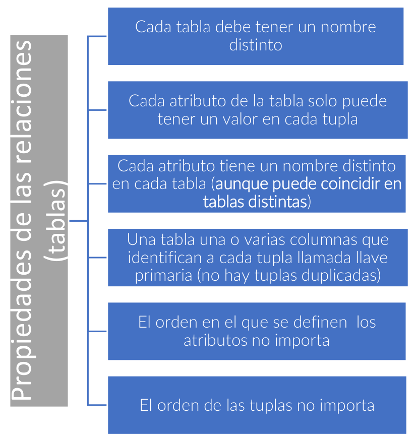
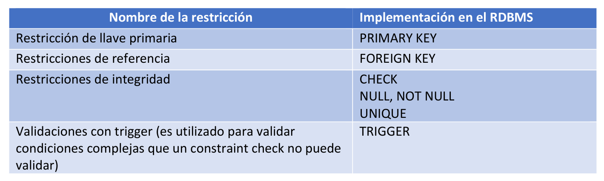
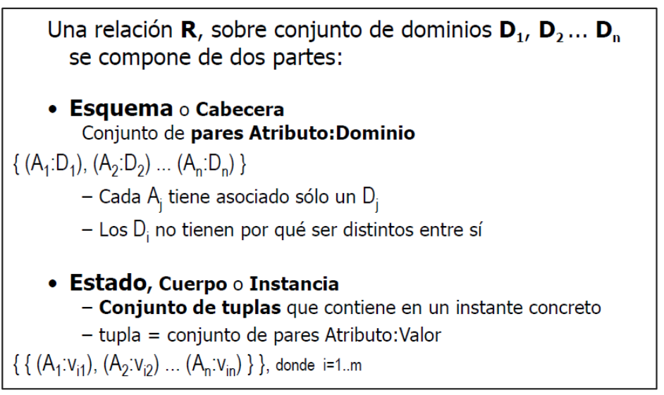
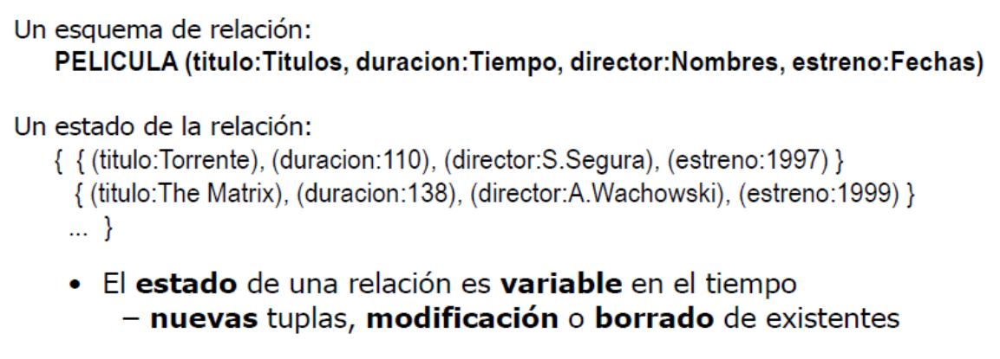

# Modelo Relacional

El modelo relacional es un modelo lógico para la organización y manipulación de datos propuesto por Edgar F. Codd en 1970.

Representa la información mediante relaciones (tablas) y constituye la base de los sistemas gestores de bases de datos relacionales (RDBMS) modernos.

---

# Índice

- [Características del modelo relacional](#características-del-modelo-relacional)
- [Estructura lógica de los datos](#estructura-lógica-de-los-datos)
  - [Relación](#relación)
  - [Tupla](#tupla)
  - [Atributo](#atributo)
  - [Dominio](#dominio)
  - [Cardinalidad](#cardinalidad)
  - [Grado](#grado)
- [Relaciones y tablas](#relaciones-y-tablas)
- [Atributos](#atributos)
- [Restricciones (Constraints)](#restricciones-constraints)
- [Llaves](#llaves)
- [Integridad referencial](#integridad-referencial)
- [Reglas de Codd](#reglas-de-codd)
- [Esquema e instancia](#esquema-e-instancia)
- [Formatos del modelo relacional](#formatos-del-modelo-relacional)

---

# Características del modelo relacional

El modelo relacional surge como resultado de la transformación del modelo Entidad-Relación hacia una representación lógica basada en tablas.

Se fundamenta en:

- Lógica de predicados.
- Teoría de conjuntos.
- Estructura lógica de los datos.
- Reglas de integridad.
- Manipulación de datos.
- Cálculo relacional.
- Álgebra relacional.

<p align="center">
  
</p>

## Lógica de predicados

Permite expresar proposiciones y determinar si son verdaderas o falsas.

### Ejemplo

```text
Todos los hombres son mortales
Sócrates es hombre
Luego Sócrates es mortal
```

---

## Teoría de conjuntos

Permite representar y manipular conjuntos de datos mediante operaciones matemáticas.

---

## Cálculo relacional

Lenguaje declarativo basado en lógica de predicados.

Describe:

```text
Qué se desea obtener
```

sin especificar:

```text
Cómo obtenerlo
```

### Ejemplo

```text
ESTUDIANTE:
ESTADONACIMIENTO='OAXACA'
AND EDAD > 23
```

---

## Álgebra relacional

Lenguaje procedural que utiliza operaciones sobre relaciones para obtener resultados.

Ambos enfoques son equivalentes y constituyen la base teórica de SQL.

---

# Estructura lógica de los datos

La estructura lógica del modelo relacional está formada por:

- Relación
- Tupla
- Atributo
- Dominio
- Cardinalidad
- Grado

<p align="center">
  
</p>

---

## Relación

Es la estructura fundamental del modelo relacional.

En la práctica corresponde a una tabla.

---

## Tupla

Corresponde a una fila de una tabla.

Representa una instancia específica de la entidad.

---

## Atributo

Corresponde a una columna de la tabla.

Describe una característica de la entidad.

---

## Dominio

Conjunto válido de valores que puede tomar un atributo.

### Ejemplos

```text
Sexo = {M, F}
```

```text
Edad = números enteros positivos
```

---

## Cardinalidad

Número total de tuplas (filas) existentes en una relación.

---

## Grado

Número total de atributos (columnas) de una relación.

---

# Relaciones y tablas

Una tabla es la implementación física de una relación.

Constituye la unidad principal de almacenamiento de un RDBMS.

---

## Tipos de relaciones

### Persistentes

Son creadas por los usuarios y permanecen almacenadas.

#### Tablas base

Son tablas independientes que almacenan información.

#### Vistas

Son consultas almacenadas que muestran información derivada de otras tablas.

#### Vistas materializadas

Almacenan además una copia de los resultados para mejorar el rendimiento.

---

### Temporales

Son creadas automáticamente por el sistema y eliminadas cuando dejan de ser necesarias.

---

## Propiedades de las relaciones

<p align="center">
  
</p>

### Reglas

- Cada tabla debe tener un nombre único.
- Cada atributo tiene un nombre único dentro de la tabla.
- Cada atributo contiene un único valor por fila.
- No existen filas duplicadas.
- El orden de filas y columnas no es significativo.

---

# Atributos

Los atributos poseen características adicionales.

---

## Valor por defecto

Valor asignado automáticamente cuando el usuario no proporciona uno.

---

## Valor nulo

Representa ausencia de valor.

```text
NULL ≠ 0
NULL ≠ ""
NULL ≠ " "
```

Para evaluarlo se utilizan:

```sql
IS NULL
IS NOT NULL
```

---

## Dominio

Restringe los valores válidos que puede contener una columna.

### Ejemplo

```text
Sexo = {M,F}
```

El DBMS verifica automáticamente que los datos pertenezcan al dominio definido.

---

# Restricciones (Constraints)

Las restricciones garantizan la integridad de los datos.

<p align="center">
  
</p>

| Restricción | Implementación |
|------------|------------|
| Llave primaria | PRIMARY KEY |
| Llave foránea | FOREIGN KEY |
| Integridad | CHECK |
| Obligatorio | NOT NULL |
| Unicidad | UNIQUE |
| Procedimental | TRIGGER |

---

# Llaves

---

## Llave candidata

Atributo o conjunto de atributos capaz de identificar de forma única cada tupla.

---

## Llave primaria (PK)

Llave candidata elegida por el diseñador.

Características:

- No admite NULL.
- No admite duplicados.
- Debe ser estable en el tiempo.

---

## Llave primaria compuesta

Está formada por más de un atributo.

### Ejemplo

```text
(ID_ALUMNO, ID_MATERIA)
```

---

## Llave alternativa (AK)

Llave candidata que no fue seleccionada como llave primaria.

---

# Integridad referencial

La integridad referencial se implementa mediante llaves foráneas (FK).

Una FK permite relacionar una tabla hija con una tabla padre.

### Características

- Debe existir previamente la PK referenciada.
- Puede contener valores repetidos.
- El DBMS valida automáticamente la existencia del registro padre.

---

## Reglas de actualización y borrado

### NO ACTION

Impide borrar o modificar registros referenciados.

### CASCADE

Propaga cambios a registros relacionados.

### SET NULL

Asigna NULL a la FK cuando desaparece el registro padre.

---

# Restricciones de integridad

---

## NOT NULL

Impide almacenar valores nulos.

---

## CHECK

Valida una condición lógica.

### Ejemplo

```sql
CHECK (edad >= 18)
```

---

## UNIQUE

Impide valores repetidos en una columna.

Implementa las llaves candidatas.

---

## TRIGGER

Programa que se ejecuta automáticamente cuando ocurre:

- INSERT
- UPDATE
- DELETE

Permite implementar reglas de negocio complejas.

---

# Reglas de Codd

En 1985 Edgar F. Codd publicó doce reglas para determinar si un sistema puede considerarse relacional.

Las más importantes son:

1. Toda la información debe almacenarse en tablas.
2. Todo dato debe ser accesible mediante PK.
3. Tratamiento adecuado de NULL.
4. Catálogo relacional accesible.
5. Lenguaje completo para manejo de datos.
6. Actualización de vistas.
7. Operaciones a nivel conjunto.
8. Independencia física de los datos.
9. Independencia lógica de los datos.
10. Independencia de integridad.
11. Independencia de distribución.
12. No subversión de las reglas relacionales.

Además existe la:

### Regla 0

Todo sistema que se anuncie como relacional debe gestionar completamente sus datos mediante capacidades relacionales.

---

# Esquema e instancia

---

## Esquema

Define la estructura de una relación.

Incluye:

- Nombre de la tabla.
- Atributos.
- Dominios.
- Restricciones.
- Relaciones.

---

## Instancia o estado

Es el contenido real de una tabla en un momento determinado.

<p align="center">
  
</p>

---

# Notación del esquema relacional

La notación general es:

```text
R = {A : D | I}
```

Donde:

| Símbolo | Significado |
|----------|----------|
| R | Relación |
| A | Atributos |
| D | Dominios |
| I | Restricciones de integridad |

<p align="center">
  
</p>

---

# Formatos del modelo relacional

Los formatos más utilizados en la industria son:

1. Relational Format.
2. Crow's Foot (Pata de Gallo).
3. IDEF1X.

> En este curso se utilizará principalmente la notación Crow's Foot.

---

# Resumen

El modelo relacional representa la información mediante tablas relacionadas entre sí.

Sus principales componentes son:

- Relaciones.
- Tuplas.
- Atributos.
- Dominios.
- Restricciones.
- Llaves.
- Integridad referencial.

Estos conceptos constituyen la base teórica sobre la que funcionan los sistemas gestores de bases de datos relacionales modernos.