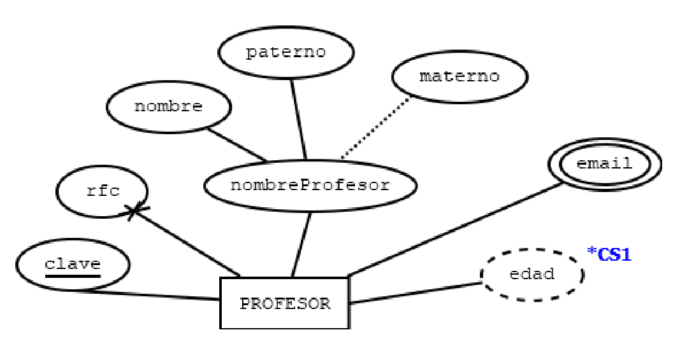
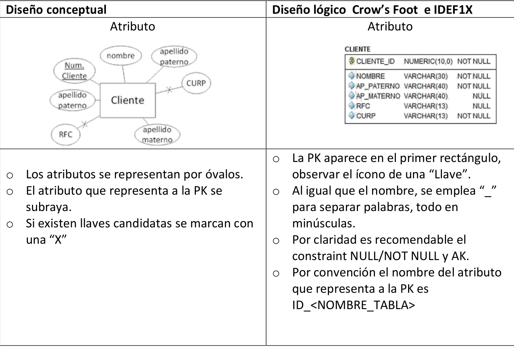
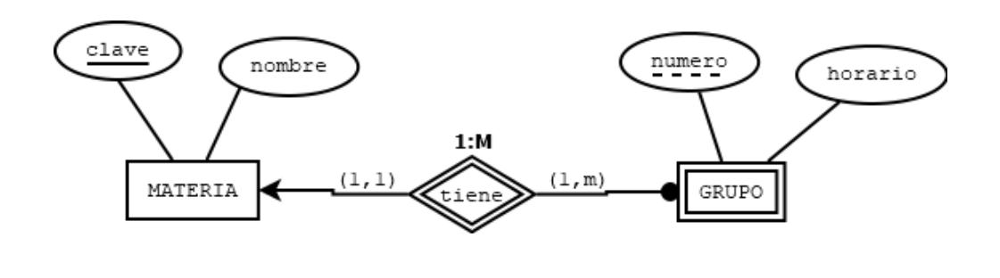
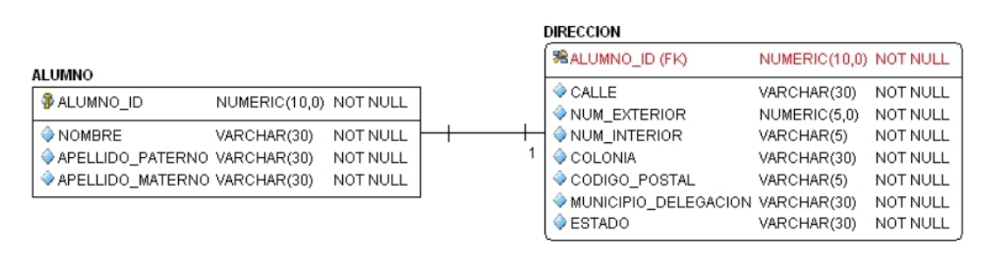
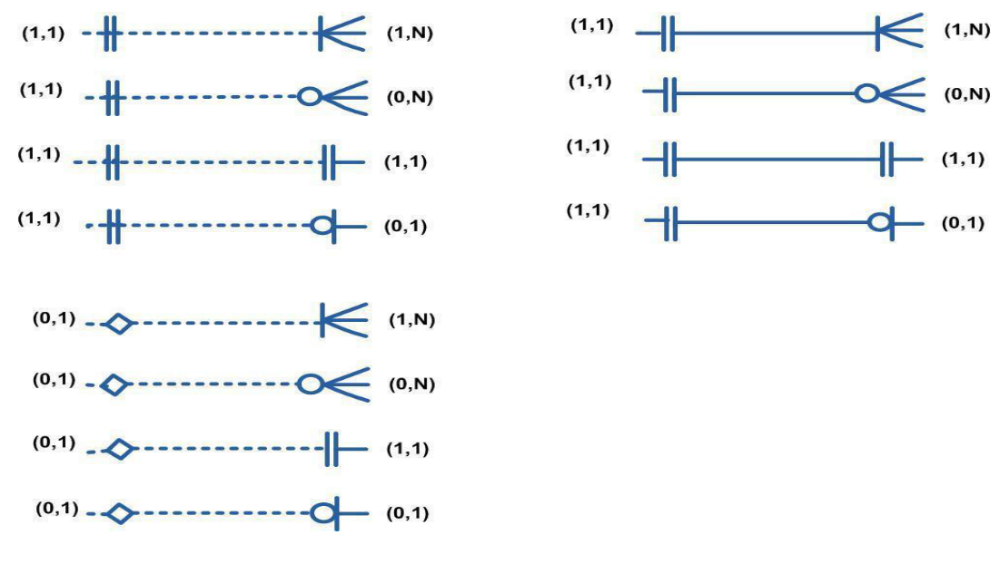
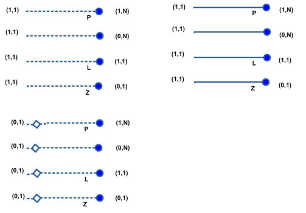

# Diseño Lógico

El diseño lógico consiste en transformar un modelo Entidad-Relación (E-R) en un modelo relacional compuesto por tablas, llaves primarias, llaves foráneas y restricciones de integridad.

Su objetivo es representar correctamente la información de una base de datos para posteriormente implementarla en un Sistema Gestor de Bases de Datos (DBMS).

---

# Índice

- [Transformación al modelo relacional](#transformación-al-modelo-relacional)
- [Entidad fuerte](#entidad-fuerte)
- [Representación de atributos](#representación-de-atributos)
- [Entidades débiles](#entidades-débiles)
- [Relaciones](#relaciones)
  - [Relación 1:1](#relación-11)
  - [Relación 1:M](#relación-1m)
  - [Relación M:M](#relación-mm)
  - [Relaciones recursivas](#relaciones-recursivas)
- [Relaciones identificativas y no identificativas](#relaciones-identificativas-y-no-identificativas)
- [Cardinalidades](#cardinalidades)
- [Dependencia de existencia](#dependencia-de-existencia)

---

# Transformación al modelo relacional

La transformación de un modelo Entidad-Relación al modelo relacional sigue una serie de reglas que permiten convertir entidades y relaciones en tablas.

## Reglas generales

- Toda entidad fuerte se convierte en una tabla.
- Se conserva la llave primaria.
- Las llaves candidatas se convierten en restricciones UNIQUE.
- Los atributos compuestos se dividen en atributos simples.
- Los atributos multivaluados generan nuevas tablas.
- Los atributos derivados pueden omitirse o calcularse dinámicamente.
- Se establecen restricciones sobre los atributos.

---

# Entidad fuerte

Toda entidad fuerte se transforma en una tabla conservando sus atributos y su llave primaria.

### Restricciones utilizadas

| Restricción | Significado |
|------------|------------|
| PK | Primary Key |
| FK | Foreign Key |
| U | Unique |
| CK | Check |
| C | Calculado |
| D | Discriminante |
| N | Opcional (Nullable) |

### Ejemplo

```text
PROFESOR = {
    clave(PK),
    nombre,
    paterno,
    materno(N),
    rfc(U),
    edad(C)
}
```

```text
EMAILPROF = {
    email(PK),
    clave(FK, PK)
}
```

<p align="center">
  
</p>

---

# Representación de atributos

Durante la transformación al modelo relacional los atributos cambian su representación.

## Modelo E-R

- Los atributos se representan mediante óvalos.
- La llave primaria aparece subrayada.
- Las llaves candidatas se identifican mediante una marca especial.

## Modelo lógico

- La PK aparece en la sección superior de la tabla.
- Los nombres utilizan guion bajo (_).
- Es recomendable indicar NULL / NOT NULL.
- Se pueden definir claves alternativas (AK).

### Convención

Por claridad suele utilizarse:

```text
ID_<NOMBRE_TABLA>
```

Ejemplo:

```text
ID_CLIENTE
ID_PRODUCTO
ID_PROFESOR
```

<p align="center">
  
</p>

---

# Entidades débiles

Una entidad débil depende de una entidad fuerte para poder identificarse.

Al transformarla:

1. Se crea una tabla para la entidad débil.
2. Se propaga la PK de la entidad fuerte.
3. La PK de la entidad débil se forma con:
   - La PK de la entidad fuerte.
   - El atributo discriminante.

### Ejemplo

```text
MATERIA = {
    clave(PK),
    nombre
}
```

```text
GRUPO = {
    [clave(FK), numero(D)](PK),
    horario
}
```

Donde:

- `clave` proviene de MATERIA.
- `numero` es el discriminante.

<p align="center">
  
</p>

---

# Relaciones

Las relaciones también deben transformarse al modelo relacional.

---

## Relación 1:1

La llave primaria de una entidad se propaga a la otra como llave foránea.

Dependiendo de la cardinalidad mínima:

- Puede ser obligatoria.
- Puede ser opcional.

En algunos casos también se aplica una restricción UNIQUE para garantizar la relación uno a uno.

---

## Relación 1:M

La llave primaria de la entidad del lado "1" se propaga a la entidad del lado "Muchos".

### Regla

```text
PK (1) → FK (M)
```

### Ejemplo

```text
CIUDAD
```

```text
SUCURSAL
```

Cada sucursal pertenece a una ciudad, pero una ciudad puede tener múltiples sucursales.

---

## Relación M:M

Las relaciones muchos a muchos generan una nueva tabla.

La nueva tabla contiene:

- PK de la primera entidad.
- PK de la segunda entidad.
- Atributos descriptivos de la relación.

### Ejemplo

```text
ALUMNO
```

```text
MATERIA
```

Generan:

```text
ALUMNO_MATERIA
```

---

## Relaciones recursivas

Ocurren cuando una entidad se relaciona consigo misma.

### Ejemplo

```text
EMPLEADO = {
    claveEmp(PK),
    nombreEmp,
    claveSup(FK)
}
```

Donde:

- Un empleado puede tener un supervisor.
- El supervisor también es un empleado.

---

# Relaciones identificativas y no identificativas

El modelo lógico distingue dos niveles de dependencia.

---

## Relación no identificativa

Características:

- Normalmente utilizada en relaciones 1:M.
- Se representa con línea punteada.
- La FK no forma parte de la PK de la tabla hija.

Ejemplo:

```text
CIUDAD → SUCURSAL
```

---

## Relación identificativa

Características:

- Utilizada en relaciones 1:1.
- Se representa con línea continua.
- La FK forma parte de la PK de la tabla hija.

La tabla hija comparte la identidad de la tabla padre.

<p align="center">
  
</p>

---

# Cardinalidades

Las cardinalidades indican cuántas instancias de una entidad pueden asociarse con otra.

## Cardinalidades comunes

| Cardinalidad | Significado |
|-------------|-------------|
| (1,1) | Exactamente uno |
| (0,1) | Cero o uno |
| (1,N) | Uno o muchos |
| (0,N) | Cero o muchos |

---

## Notación Crow's Foot

Es una de las representaciones más utilizadas para diagramas lógicos.

<p align="center">
  
</p>

---

## Notación IDEF1X

Otra notación ampliamente utilizada para modelado lógico.

<p align="center">
  
</p>

---

# Dependencia de existencia

La dependencia de existencia determina si una entidad hija puede existir sin una entidad padre.

---

## Dependiente de existencia

La entidad hija no puede existir sin la entidad padre.

### Implementación

La FK debe ser:

```text
NOT NULL
```

### Cardinalidad

```text
(1,1)
```

---

## Independiente de existencia

La entidad hija puede existir sin la entidad padre.

### Implementación

La FK puede ser:

```text
NULL
```

### Cardinalidad

```text
(0,1)
```

---

# Resumen

El diseño lógico transforma el modelo Entidad-Relación en un conjunto de tablas relacionales listas para implementarse en un DBMS.

Durante este proceso se definen:

- Llaves primarias.
- Llaves foráneas.
- Restricciones de integridad.
- Cardinalidades.
- Dependencias entre entidades.

Un diseño lógico correcto garantiza una base sólida para la implementación física de la base de datos.