# Transformación Avanzada al Modelo Relacional

Este tema aborda la transformación de construcciones avanzadas del Modelo Entidad-Relación Extendido (EER) hacia un modelo relacional.

A diferencia de los casos básicos vistos en Diseño Lógico, aquí se analizan estructuras como:

- Generalización
- Especialización
- Restricciones de exclusión
- Restricciones de traslape
- Agregación
- Históricos

---

# Índice

- Introducción
- Generalización no exclusiva
- Generalización exclusiva
- Especialización no exclusiva
- Especialización exclusiva
- Agregación
- Históricos
- Comparación Crow's Foot e IDEF1X

---

# Introducción

Cuando un modelo conceptual incorpora herencia, subtipos, supertipos o estructuras avanzadas, existen distintas estrategias para transformarlo al modelo relacional.

La selección depende de:

- Restricciones de negocio.
- Cardinalidades.
- Exclusividad entre subtipos.
- Participación total o parcial.

---

# Generalización no exclusiva

También llamada:

```text
Overlapping Total
```

## Regla de negocio

Un empleado debe tener al menos un rol y puede tener varios simultáneamente.

Ejemplos:

- Arquitecto e Ingeniero.
- Ingeniero y Administrativo.

---

## Modelo conceptual

<p align="center">
  
</p>

---

## Transformación Crow's Foot

Características:

- Los subtipos heredan la PK del supertipo.
- Se crea una tabla para el discriminante multivaluado.
- Se permite la coexistencia de varios roles.

<p align="center">
  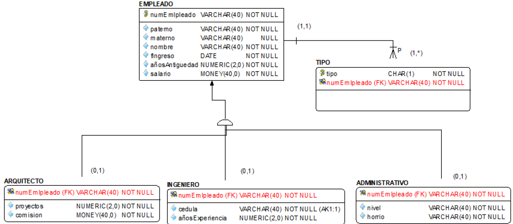
</p>

---

## Transformación IDEF1X

Para indicar traslape se utiliza:

```text
O (Overlapping)
```

<p align="center">
  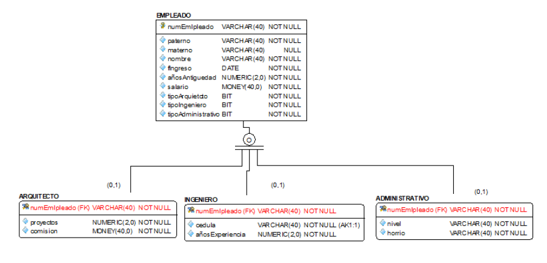
</p>

---

# Generalización exclusiva

También llamada:

```text
Disjoint Total
```

## Regla de negocio

Un empleado debe tener exactamente un rol.

Ejemplos:

- Arquitecto
- Ingeniero
- Administrativo

pero nunca más de uno al mismo tiempo.

---

## Modelo conceptual

<p align="center">
  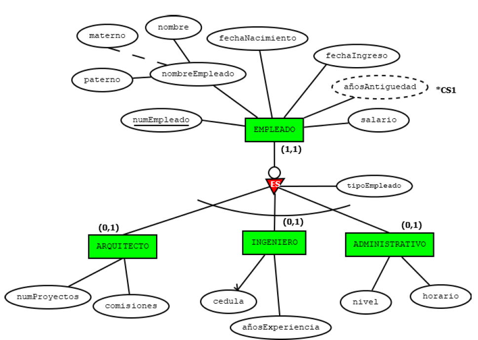
</p>

---

## Transformación Crow's Foot

Características:

- Los subtipos heredan la PK.
- El discriminante se modela como CHAR(1).
- Existe exclusividad entre subtipos.

<p align="center">
  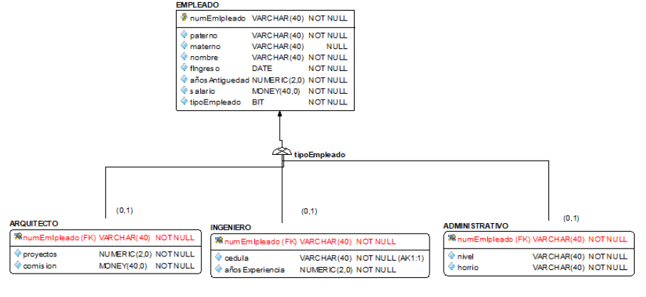
</p>

---

## Transformación IDEF1X

Para representar exclusividad se utiliza:

```text
D (Disjoint)
```

<p align="center">
  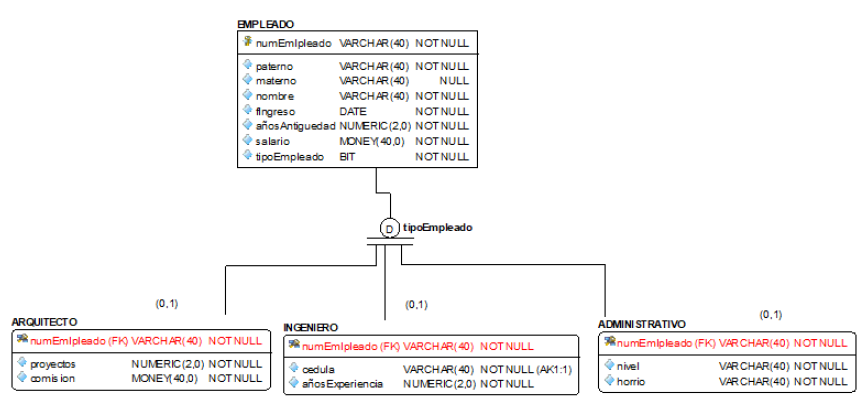
</p>

---

# Especialización no exclusiva

También conocida como:

```text
Overlapping Partial
```

## Regla de negocio

Un empleado puede no tener ningún rol.

Si tiene uno, puede tener varios simultáneamente.

---

## Modelo conceptual

<p align="center">
  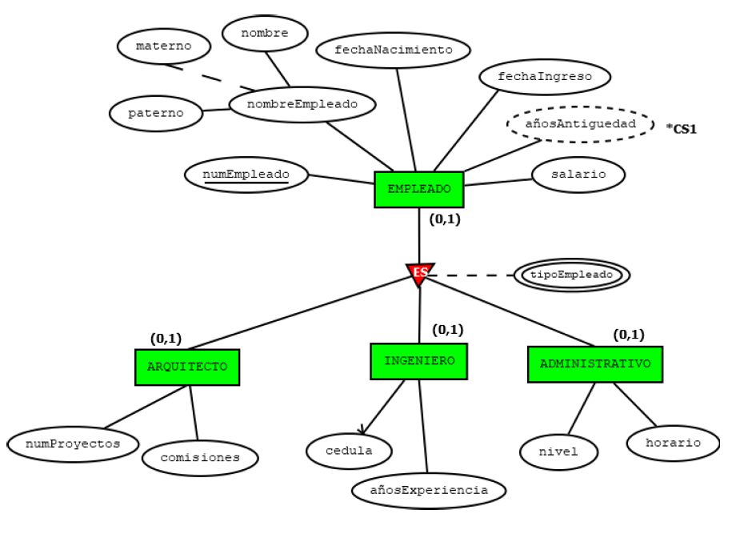
</p>

---

## Transformación Crow's Foot

Difiere de la generalización total debido a que:

```text
(0,*)
```

permite participación opcional.

<p align="center">
  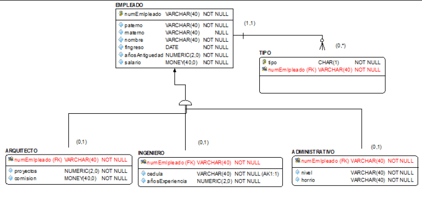
</p>

---

## Transformación IDEF1X

Características:

- Línea sencilla para indicar participación parcial.
- O para indicar overlapping.

<p align="center">
  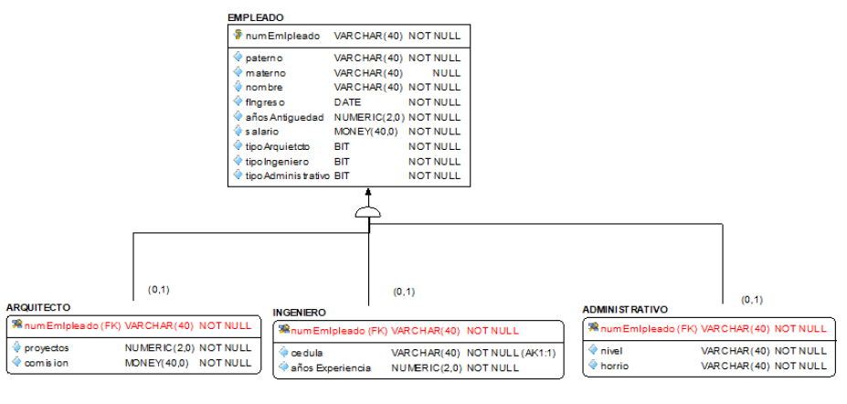
</p>

---

# Especialización exclusiva

También conocida como:

```text
Disjoint Partial
```

## Regla de negocio

Un empleado puede tener un único rol o ninguno.

El discriminante es opcional.

---

## Modelo conceptual

<p align="center">
  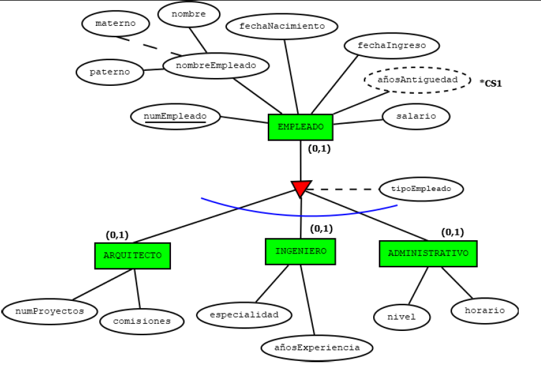
</p>

---

## Transformación Crow's Foot

Características:

- El discriminante permite NULL.
- No existe notación específica para exclusividad parcial.

<p align="center">
  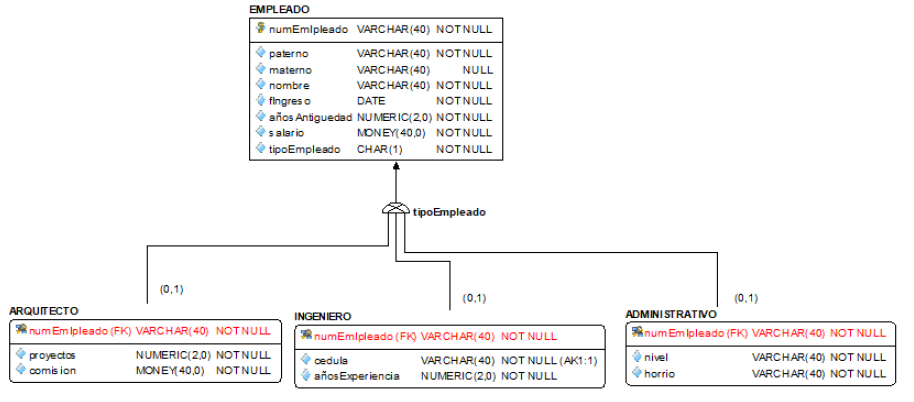
</p>

---

## Transformación IDEF1X

Características:

- Línea sencilla para participación parcial.
- D para indicar disjoint.

<p align="center">
  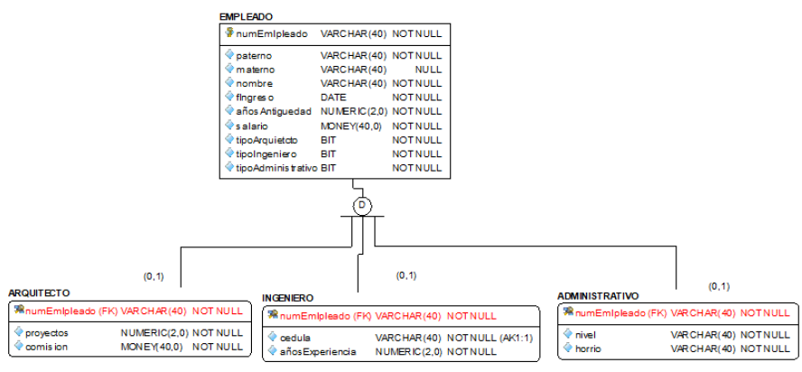
</p>

---

# Agregación

La agregación permite modelar situaciones donde una relación participa en otra relación.

En otras palabras, permite tratar una relación como si fuera una entidad para poder relacionarla con otros elementos del modelo.

Es útil cuando una relación tiene significado propio dentro del negocio y necesita participar en nuevas asociaciones.

---

## Procedimiento de transformación

### Paso 1

Transformar la relación interna.

La relación genera una nueva tabla cuya llave primaria identificará de manera única cada ocurrencia.

### Paso 2

Transformar la relación externa considerando la nueva tabla generada.

La tabla resultante participa como cualquier otra entidad dentro del modelo relacional.

---

## Consideraciones

- La relación interna se convierte en una tabla.
- Su llave primaria se propaga a las relaciones externas.
- Se mantienen las restricciones de integridad referencial.
- La agregación permite representar escenarios complejos de negocio sin perder consistencia en el modelo relacional.

---

# Históricos

Los históricos permiten conservar información pasada sin perder el estado actual de los datos.

Son especialmente útiles cuando se requiere:

- Trazabilidad.
- Auditoría.
- Seguimiento de cambios.
- Conservación de versiones históricas.

---

## Modelo conceptual

<p align="center">
  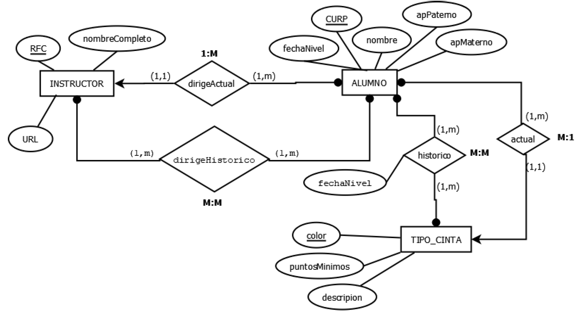
</p>

En este modelo se representan simultáneamente:

- Relaciones actuales.
- Relaciones históricas.
- Cambios de nivel.
- Cambios de instructor.
- Evolución de la información a través del tiempo.

---

## Transformación al modelo relacional

<p align="center">
  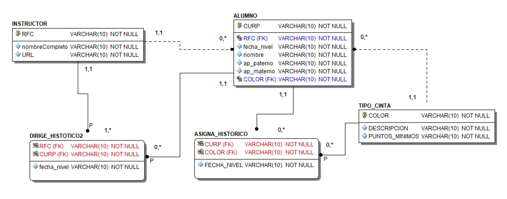
</p>

Observaciones:

- Las relaciones históricas se materializan mediante tablas independientes.
- Se conservan los datos actuales sin sobrescribir información pasada.
- Se utilizan llaves foráneas para mantener la consistencia entre las entidades involucradas.
- El historial queda disponible para consultas y auditorías futuras.

---

## Ventajas

- Conserva el historial completo de cambios.
- Permite realizar auditorías.
- Facilita análisis históricos.
- Evita pérdida de información relevante.

---

## Consideraciones

Implementar históricos implica:

- Mayor volumen de almacenamiento.
- Más tablas y relaciones.
- Consultas potencialmente más complejas.

Por ello, deben utilizarse cuando exista una necesidad real de conservar información pasada.