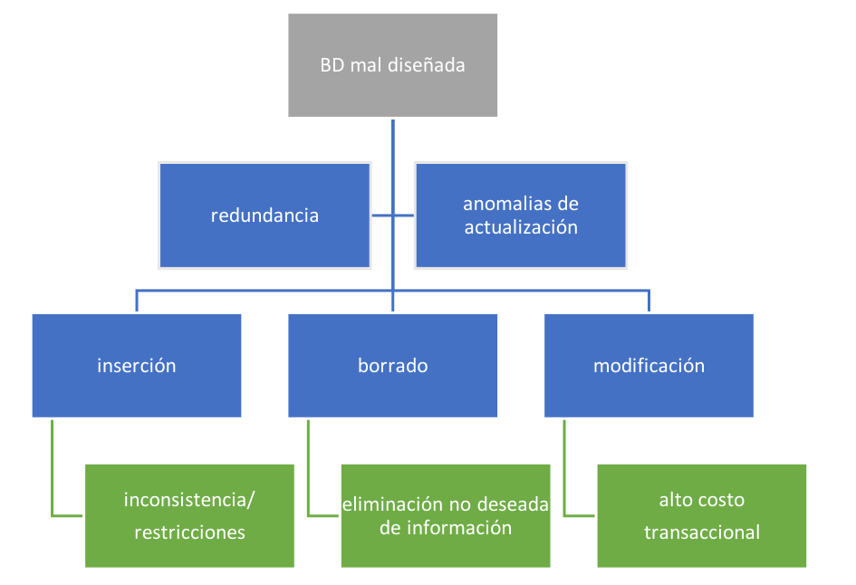
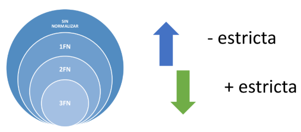
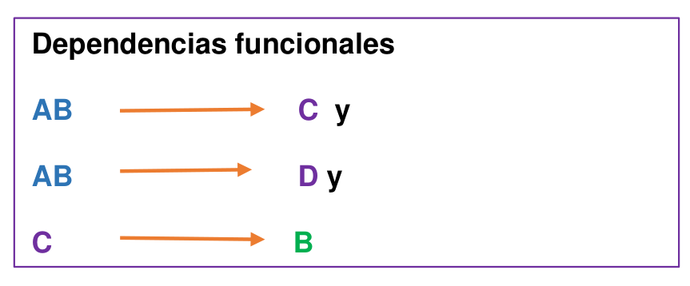
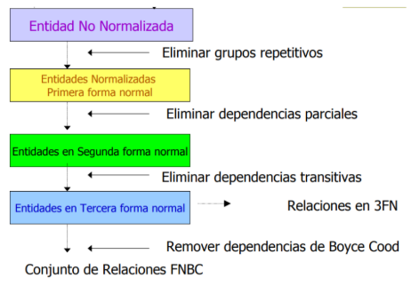
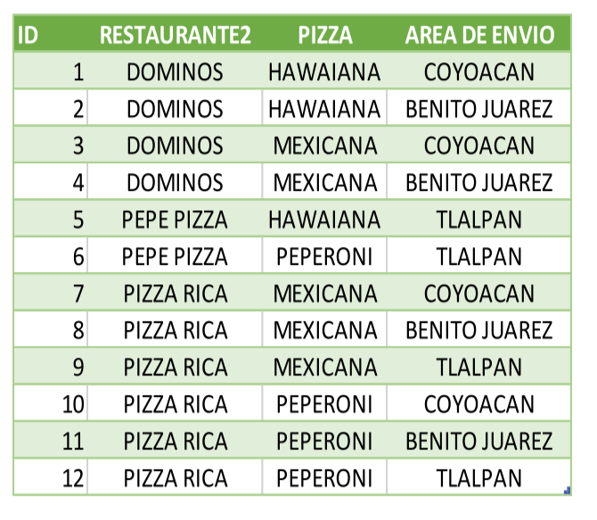
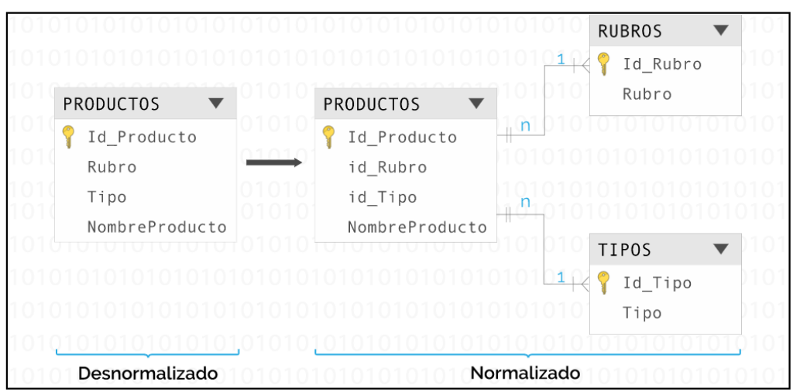
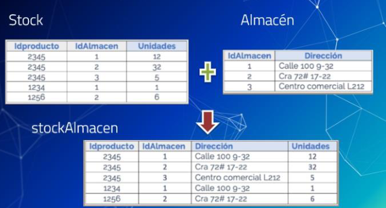
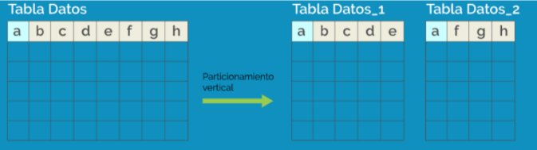
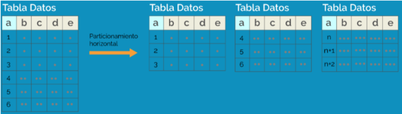

# Normalización

La normalización es un proceso utilizado en bases de datos relacionales para reducir la redundancia de datos, evitar anomalías de actualización y mejorar la integridad de la información.

---

# Índice

* [Anomalías de actualización](#anomalías-de-actualización)
* [Formas normales](#formas-normales)

  * [Dependencia funcional](#dependencia-funcional)
  * [Primera Forma Normal (1FN)](#primera-forma-normal-1fn)
  * [Segunda Forma Normal (2FN)](#segunda-forma-normal-2fn)
  * [Tercera Forma Normal (3FN)](#tercera-forma-normal-3fn)
  * [Forma Normal de Boyce-Codd (FNBC)](#forma-normal-de-boyce-codd-fnbc)
  * [Cuarta Forma Normal (4FN)](#cuarta-forma-normal-4fn)
* [Catálogos](#catálogos)
* [Llaves artificiales](#llaves-artificiales)
* [Desnormalización](#desnormalización)

---

# Anomalías de actualización

Las anomalías de actualización son efectos no deseados que aparecen cuando existe redundancia de información dentro de una base de datos.

<p align="center">
  
</p>

## Anomalía de inserción

Ocurre cuando no es posible almacenar cierta información sin registrar datos adicionales que realmente no existen o no son necesarios.

### Ejemplo

No poder registrar el teléfono de un empleado porque aún no tiene asignado un proyecto.

---

## Anomalía de modificación

Ocurre cuando un dato se encuentra repetido en múltiples registros.

Si un empleado cambia su número telefónico, será necesario actualizar todas las filas donde aparezca dicho número.

### Consecuencias

* Mayor costo transaccional.
* Riesgo de inconsistencias.
* Mayor complejidad de mantenimiento.

---

## Anomalía de borrado

Ocurre cuando al eliminar un registro también se elimina información que debería conservarse.

### Ejemplo

Eliminar la última asignación de un empleado a un proyecto y perder también su número telefónico.

---

# Formas normales

Las formas normales son un conjunto de reglas que permiten estructurar correctamente una base de datos relacional.



A medida que aumenta el nivel de normalización, las restricciones son más estrictas y disminuye la redundancia.

---

# Dependencia funcional

Una dependencia funcional representa una relación entre atributos.

```text
A → B
```

Se interpreta como:

* A determina a B.
* B depende funcionalmente de A.

<p align="center">
  
</p>


### Ejemplo

```text
NumCuenta → Teléfono
```

Si se conoce el número de cuenta, se puede determinar un único teléfono.

---

# Primera Forma Normal (1FN)

Una tabla se encuentra en Primera Forma Normal cuando:

1. Todos los valores son atómicos.
2. No existen grupos repetitivos.
3. Existe una clave primaria.

## Aplicación de la 1FN

* Eliminar grupos repetidos.
* Dividir atributos compuestos.
* Garantizar atomicidad.
* Identificar la clave primaria.
* Detectar dependencias parciales y transitivas.

---

# Segunda Forma Normal (2FN)

Una tabla se encuentra en Segunda Forma Normal cuando:

* Está en 1FN.
* No existen dependencias parciales.

> Si la tabla tiene una clave primaria simple, automáticamente cumple 2FN.

## Procedimiento

1. Identificar dependencias parciales.
2. Crear nuevas tablas para dichas dependencias.
3. Convertir los determinantes en claves primarias de las nuevas tablas.
4. Mantener referencias mediante claves foráneas.

---

# Tercera Forma Normal (3FN)

Una tabla se encuentra en Tercera Forma Normal cuando:

* Está en 2FN.
* No existen dependencias transitivas.

## Procedimiento

1. Identificar atributos dependientes de otros atributos no llave.
2. Crear nuevas tablas para dichas dependencias.
3. Mantener la relación mediante claves foráneas.

---

## Resumen del proceso de normalización



---

# Forma Normal de Boyce-Codd (FNBC)

La FNBC fue propuesta por Raymond F. Boyce y Edgar F. Codd para resolver ciertos casos que no eran cubiertos completamente por la 3FN.

Una tabla está en FNBC cuando:

* Está en 3FN.
* Todos los determinantes son claves candidatas.

## Características

* Más estricta que la 3FN.
* Aplica principalmente cuando existen múltiples claves candidatas.
* Reduce aún más la redundancia.

---

# Cuarta Forma Normal (4FN)

Una tabla se encuentra en Cuarta Forma Normal cuando:

* Está en 3FN.
* No contiene dependencias multivaluadas.

## Dependencia multivaluada

Ocurre cuando dos relaciones independientes de tipo muchos a muchos generan redundancia dentro de la misma tabla.

### Ejemplo

Un restaurante puede:

* Ofrecer varios tipos de pizza.
* Repartir en varias zonas.

Ambas relaciones son independientes entre sí, pero al almacenarlas en una sola tabla se generan múltiples combinaciones redundantes.

<p align="center">
  
</p>

La solución consiste en separar las relaciones:

```text
RESTAURANTE_PIZZA
```

y

```text
RESTAURANTE_ZONA
```

---

# Catálogos

Un catálogo es una tabla utilizada para almacenar valores de referencia que pueden ser utilizados por otras tablas.

## Ejemplo

```text
ESPECIALIDAD
------------
IdEspecialidad (PK)
Descripcion
```

```text
MEDICO
-------
IdMedico (PK)
Nombre
IdEspecialidad (FK)
```

## Ventajas

* Reduce redundancia.
* Facilita mantenimiento.
* Permite modificaciones dinámicas.
* Favorece la normalización.

---

# Llaves artificiales

Son claves primarias sin significado de negocio utilizadas únicamente para identificar registros.

## Ejemplos

* IDENTITY (SQL Server)
* AUTO_INCREMENT (MySQL)
* UUID / GUID

## Ventajas

* Uniformidad.
* Menor tamaño de índices.
* Mejor rendimiento en consultas y joins.

## Desventajas

* Requieren restricciones adicionales para evitar duplicados lógicos.
* Generan dependencia de claves artificiales.

---

# Desnormalización

La desnormalización consiste en revertir parcialmente el proceso de normalización para mejorar el rendimiento de ciertas consultas.

> Un modelo desnormalizado no es lo mismo que un modelo mal diseñado.

## Objetivos

* Reducir joins.
* Mejorar tiempos de respuesta.
* Simplificar consultas complejas.

## Consideraciones

<p align="center">
  
</p>

---

## Técnica de combinación de tablas

Consiste en volver a unir tablas previamente separadas durante el proceso de normalización.

### Ejemplo

```text
STOCK
------
IdProducto
IdAlmacen
Unidades
```

```text
ALMACEN
--------
IdAlmacen
Direccion
```

Se pueden combinar en:

```text
STOCK_ALMACEN
-------------
IdProducto
IdAlmacen
Direccion
Unidades
```

---

## Técnica de duplicación de datos

Consiste en copiar ciertos datos entre tablas para evitar consultas frecuentes o costosas.

### Ejemplo

Agregar el campo Mes directamente en DetalleFactura para simplificar reportes mensuales.



---

## Técnica de particionamiento

Consiste en dividir una tabla grande en varias tablas más pequeñas.

### Particionamiento vertical

Divide columnas.



### Particionamiento horizontal

Divide filas.



---

# Resumen

La normalización es una metodología para diseñar bases de datos consistentes, reducir redundancia y evitar anomalías mediante la aplicación progresiva de formas normales.

En la práctica, la mayoría de los modelos se normalizan hasta 3FN o FNBC, mientras que la desnormalización se utiliza únicamente cuando existen necesidades específicas de rendimiento.
